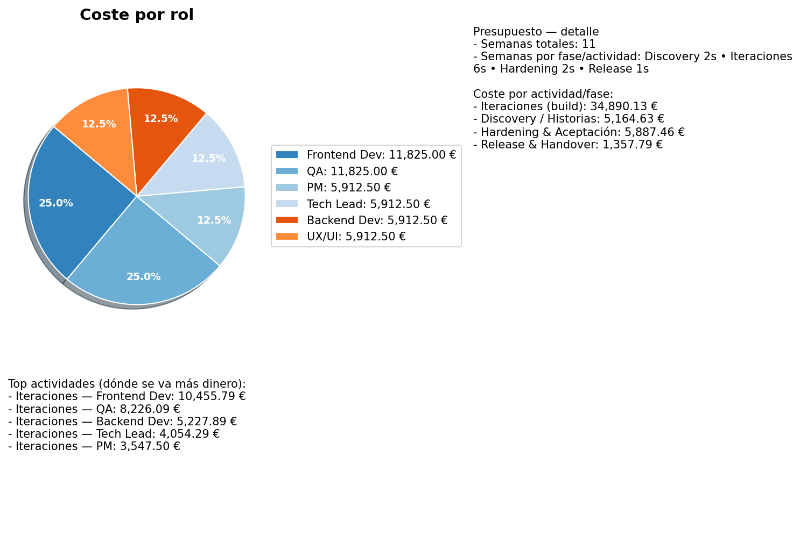

# TFGv3

## Para arrancar el frontend
### npm run dev

## Generar gráfico de desglose del presupuesto

Se incluye un script sencillo para generar un gráfico de pastel similar al adjunto en `scripts/budget_pie.py`.


```powershell
C:/Users/HP/Desktop/TFGv3/.venv/Scripts/python.exe scripts/budget_pie.py
```


### Vista previa


# TFGv3

## Para arrancar el backend :
### .\.venv\Scripts\Activate.ps1
### python -m uvicorn backend.app:app --reload --host 0.0.0.0 --port 8000

## Para arrancar el frontend
### npm run dev

## TFGv3 — Asistente para generación de propuestas de proyecto

Última actualización: 2025-11-18

Índice
- Objetivo general
- Objetivos específicos
- Descripción breve del proyecto
- Arquitectura y componentes principales
- Requisitos (local)
- Instalación y ejecución (Windows / PowerShell)
	- Backend (Python / FastAPI)
	- Frontend (React / Vite)
	- Iniciar ambos en desarrollo
- API y contratos importantes
- Flujo crítico (handshake empleados)
- Tests
	- Suite TDD (pytest)
	- Tests E2E (Playwright)
- Deploy / producción (notas rápidas)
- Troubleshooting y preguntas frecuentes
- Estructura del repositorio
- Contacto y créditos

---

**Objetivo general del trabajo**

Diseñar y desarrollar una aplicación web que permita generar propuestas de proyecto de forma automática mediante la interacción con un asistente conversacional, integrando funcionalidades de gestión de personal, planificación de fases y exportación de resultados.


**Objetivos específicos**

- Implementar un sistema conversacional capaz de guiar al usuario durante la creación de una propuesta de proyecto.
- Desarrollar un backend que gestione la lógica de negocio, el estado conversacional y la persistencia de datos.
- Construir un frontend de una sola página (SPA) que permita la interacción en tiempo real con el asistente.
- Incorporar un sistema básico de gestión de empleados vinculado al usuario.
- Permitir la generación, visualización y exportación de propuestas a formatos finales, como PDF.
- Aplicar técnicas de comprensión de intención del usuario (NLU) y recuperación semántica para mejorar la experiencia conversacional.
- Integrar una batería de pruebas basada en TDD que valide las principales funcionalidades del sistema.
- Ofrecer una experiencia de uso intuitiva y coherente con patrones modernos de diseño web.

---

## Descripción breve

TFGv3 es una aplicación de demostración que combina una API (FastAPI) y un frontend (React + Vite) para que un asistente conversacional genere propuestas de proyecto a partir de requisitos textuales. Soporta guardado de "chats/propuestas", gestión de empleados por usuario, generación de propuestas (metodología, equipo, fases, presupuesto) y exportación a PDF. Además incluye mecanismos de NLU/recuperación para mejorar respuestas y tests automatizados TDD/E2E.

---

## Arquitectura y componentes principales

- backend/: FastAPI app y lógica del motor (motor conversacional en `backend/engine/brain.py`). Persistencia ligera con SQLite y helpers en `backend/memory/state_store.py`.
- frontend/: SPA en React (Vite). Componentes principales: `Chat.jsx` (UI del asistente), `Employees.jsx`, `Auth.jsx`, `Sidebar.jsx`.
- TDD/backend_tests/: tests pytest que validan endpoints, state store y lógica del motor.
- e2e/: pruebas Playwright para flujos end-to-end (autenticación, crear proyecto, chat, cargar empleados, exportar, guardar).
- backend/retrieval/similarity.py: componente de búsqueda semántica (TF-IDF + k-NN).

---

## Requisitos (local)

- Windows 10/11 (o macOS / Linux con comandos equivalentes)
- Python 3.11 (recomendado)
- Node.js 18+ (para frontend y Playwright)
- npm (v8+) o yarn
- Opcional: `poetry` si prefieres usarlo en lugar de `pip`.

Dependencias Python: están en `requirements.txt` y en `pyproject.toml` (si usas poetry).

---

## Instalación y ejecución (PowerShell)

Estos pasos asumen que trabajas en PowerShell y quieres ejecutar backend + frontend localmente.

1) Clona el repositorio y entra en la carpeta del proyecto

```powershell
cd C:\Users\HP\Desktop
git clone <repo-url> TFGv3
cd TFGv3
```

2) Crear y activar un entorno virtual Python

```powershell
python -m venv .venv
.\.venv\Scripts\Activate.ps1
# (si PowerShell bloquea: Set-ExecutionPolicy -Scope Process -ExecutionPolicy Bypass)
```

3) Instalar dependencias Python

```powershell
pip install -r requirements.txt
# o si usas poetry:
# poetry install
```

4) Instalar dependencias frontend

```powershell
cd frontend
npm install
cd ..
```

5) (Opcional) Instalar dependencias para E2E

```powershell
cd e2e
npm install
npx playwright install --with-deps
cd ..
```

### Iniciar backend (desarrollo)

En una terminal PowerShell con el entorno Python activado:

```powershell
cd C:\Users\HP\Desktop\TFGv3
python -m uvicorn backend.app:app --reload --port 8000
```

### Iniciar frontend (desarrollo)

En otra terminal (no dentro del virtualenv de Python necesariamente):

```powershell
cd C:\Users\HP\Desktop\TFGv3\frontend
npm run dev
```

---

## API y contratos importantes

Algunos endpoints clave (método · ruta):

- POST `/auth/register` → Registro (devuelve token JWT)
- POST `/auth/login` → Login (devuelve token JWT)
- GET `/user/chats` → Listar chats/propuestas guardadas (requiere Authorization)
- POST `/user/chats` → Crear chat/propuesta guardada
- POST `/user/chats/{chat_id}/continue` → Abrir sesión de chat para continuar
- GET/POST/PUT/DELETE `/user/employees` → Gestión de empleados por usuario (requiere Authorization)
- POST `/projects/proposal` → Generar propuesta a partir de requisitos (payload: `session_id`, `requirements`)
- POST `/chat/message` → Enviar mensaje para recibir respuesta (alternativa WS `/chat/ws`)
- POST `/export/chat.pdf` → Generar PDF del chat/propuesta (retorna blob)

Importante: los endpoints protegidos usan header `Authorization: Bearer <token>` (el token lo devuelve `/auth/login` o `/auth/register`).

---

## Flujo crítico: handshake de empleados (cómo debe comportarse el frontend)

El backend espera un flujo concreto para activar la rama de asignación/planificación basada en empleados guardados:

1. Usuario solicita o acepta la propuesta → backend registra `awaiting_employee_choice` y pide si desea "usar empleados guardados" o "manual".
2. Si el usuario responde "usar empleados guardados" el backend marca `awaiting_employees_data` y responde indicando que el frontend debe enviar la lista de empleados en JSON.
3. El frontend debe enviar primero un trigger textual (por ejemplo `cargar empleados`) al backend para que éste confirme que está listo para recibir los datos.
4. Tras confirmación (o incluso si no llega por timeout), el frontend envía el JSON de empleados (array de objetos con keys `name`, `role`, `skills`, `availability_pct`, `seniority`) por WebSocket o por HTTP según implementación.
5. El backend procesa el JSON y ejecuta la rama que genera asignaciones, formación y tareas por fase.

El `frontend/src/components/Chat.jsx` ya implementa este handshake: detecta el mensaje del assistant solicitando JSON y envía automáticamente los empleados guardados (si existen) o pregunta por plantilla manual.

---

## Tests

### Suite TDD (pytest)

Los tests relacionados con la lógica del backend y contratos API se encuentran en `TDD/backend_tests/` y en `backend/tests/`.

Para ejecutar la suite TDD (recomendada, ligera):

```powershell
cd C:\Users\HP\Desktop\TFGv3
pytest -q TDD/backend_tests
```

Para ejecutar todas las pruebas Python (incluyendo `backend/tests`):

```powershell
pytest -q
```

Nota: durante el desarrollo se añadieron mecanismos para evitar colisiones de nombres de módulos de test (algunos tests se renombraron o se colocaron en `TDD` para TDD). Si pytest muestra errores de importación, limpia `__pycache__` o ejecuta `pytest -q backend TDD/backend_tests`.


### Pruebas E2E (Playwright)

Se añadieron pruebas de extremo a extremo bajo `e2e/tests/` usando Playwright. Estas pruebas automáticas cubren:
- registro/login (API)
- creación de empleado (API)
- abrir frontend con token en localStorage
- crear un proyecto (UI)
- enviar comando `/propuesta:` y comprobar respuesta
- aceptar propuesta y pulsar `Cargar empleados`
- exportar PDF desde la UI
- guardar proyecto (UI) y comprobar via API que existe

Para ejecutar las pruebas E2E:

1. Instala dependencias y navegadores (solo la primera vez):
```powershell
cd C:\Users\HP\Desktop\TFGv3\e2e
npm install
npx playwright install --with-deps
```

2. Asegúrate de que el backend y el frontend están en ejecución (pasos más arriba).

3. Ejecuta las pruebas:
```powershell
npm test
# o
npx playwright test
```

Notes:
- Si los puertos difieren, actualiza `API_BASE` y `FRONTEND` en `e2e/tests/e2e.spec.ts`.
- Las pruebas inyectan el token en `localStorage` para evitar depender del flujo UI de login. Aun así, la prueba ejerce la UI para crear proyectos/chat.

---

## Deploy / producción (breve)

- Ajusta variables de configuración en `backend/core/config.py` (secretos, base de datos). Actualmente la app usa SQLite por conveniencia.
- Para producción: usar Uvicorn + Gunicorn/Hypercorn, o dockerizar (hay un `docker/` con Dockerfile de ejemplo en el repo).
- Configura CORS y HTTPS según despliegue.

---

## Troubleshooting / FAQs

Q: `pytest` falla con errores de importación (import file mismatch)?
- A: Borra caches de Python: `find . -name "__pycache__" -type d -exec rm -rf {} +` o en Windows eliminar manualmente `__pycache__` carpetas. Reintenta `pytest` especificando carpetas concretas:
	- `pytest -q TDD/backend_tests` (solo TDD)
	- `pytest -q backend/tests` (solo tests del backend)

Q: El frontend no encuentra el backend (mensaje 'No encuentro el backend en :8000')
- A: Asegúrate de arrancar el backend y que esté escuchando en `:8000`. Si tu backend corre en otra máquina/puerto, actualiza `apiBase` en el frontend o expón el puerto correcto.

Q: Playwright no descarga los navegadores o `npm test` falla
- A: Ejecuta `npx playwright install --with-deps` y revisa errores de permisos. En Windows WSL o entornos con restricciones puede requerir componentes adicionales.

Q: Token / auth - cómo probar sin UI
- A: Usa `/auth/register` y `/auth/login` con `curl` o `requests` para obtener un token. El token se añade a `Authorization: Bearer <token>` en los requests protegidos.

Q: El backend muestra `DeprecationWarning: on_event is deprecated` al arrancar
- A: Es un warning por FastAPI. No bloquea el arranque. Para eliminarlo habría que migrar a lifespan handlers (futuro trabajo).

---

## Estructura del repositorio (resumen)

- backend/
	- app.py — instancia FastAPI y montaje de routers
	- routers/ — endpoints (auth, chat, projects, user, export...)
	- engine/ — lógica del motor conversacional (`brain.py`, planner, actions)
	- memory/ — state_store, modelos sqlite
	- retrieval/ — `similarity.py` para búsqueda semántica
- frontend/
	- src/components/Chat.jsx — interfaz del asistente y handshake empleados
	- src/components/Auth.jsx — UI de login/registro
	- index.html, main.jsx, etc.
- TDD/backend_tests/ — tests pytest añadidos para garantizar comportamiento crítico (TDD)
- e2e/ — scaffolding Playwright con `tests/e2e.spec.ts`
- requirements.txt — dependencias Python
- package.json (frontend) — dependencias frontend

---

Créditos: Proyecto desarrollado como TFG (Trabajo Fin de Grado) — autor/a: raquelcerezocarrion.